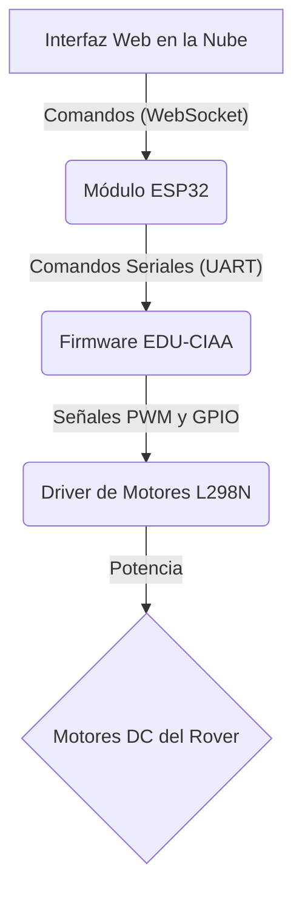

# Firmware EDU-CIAA para Rover Autónomo (PlatformIO)

Este repositorio contiene el código fuente del firmware para la placa **EDU-CIAA**, que actúa como el controlador de bajo nivel (MCU) para el proyecto de Rover Autónomo. El desarrollo está configurado para utilizar el ecosistema de **PlatformIO en Visual Studio Code**.

El objetivo de este firmware es interpretar comandos seriales provenientes de un ESP32 para gestionar el control de los motores del rover en tiempo real.

## Arquitectura del Sistema

El firmware de la EDU-CIAA es el componente fundamental para el control de hardware. La arquitectura general del sistema es la siguiente:



## Entorno de Desarrollo

Este proyecto está diseñado para ser compilado, cargado y depurado utilizando PlatformIO, una herramienta que automatiza la gestión del toolchain y las librerías.

### Prerrequisitos

1.  **Visual Studio Code**: El editor de código.
2.  **Extensión de PlatformIO IDE**: Búscala en el marketplace de extensiones de VS Code e instálala.
3.  **Git**: Para clonar el repositorio.

### Pasos para la Configuración

1.  **Clonar el repositorio:**
    ```bash
    git clone edu-ciaa-firmware
    cd edu-ciaa-firmware
    ```

2.  **Abrir el proyecto en VS Code:**
    Abre la carpeta clonada directamente en VS Code (`Archivo > Abrir Carpeta...`).

3.  **Instalar dependencias:**
    PlatformIO detectará automáticamente el archivo `platformio.ini` y descargará las plataformas, frameworks y herramientas necesarias (como el compilador GCC para ARM). No se requiere instalación manual del toolchain.

## El archivo `platformio.ini`

Este es el corazón del proyecto. Contiene toda la configuración necesaria para que PlatformIO sepa cómo compilar y cargar el código.

```ini
; platformio.ini

[env:edu-ciaa-nxp]
platform = nxplpc
board = edu-ciaa-nxp
framework = ciaa-firmware

; Configuración del puerto serie para el monitor
monitor_speed = 115200

; Aquí se pueden agregar librerías en el futuro
; lib_deps =
```

-   `platform = nxplpc`: Indica que estamos trabajando con microcontroladores NXP LPC.
-   `board = edu-ciaa-nxp`: Especifica la placa exacta.
-   `framework = ciaa-firmware`: Utiliza el framework oficial del Proyecto CIAA.
-   `monitor_speed = 115200`: Define la velocidad en baudios para el monitor serial de PlatformIO. **¡Debe coincidir con la configurada en el código!**

## Comandos Útiles de PlatformIO

Puedes ejecutar estos comandos desde la terminal integrada de VS Code o usando los botones de la barra de tareas de PlatformIO (en la parte inferior de la ventana).

-   **Compilar el proyecto (Build):**
    ```bash
    pio run
    ```
-   **Cargar el firmware a la placa (Upload):**
    ```bash
    pio run --target upload
    ```
-   **Abrir el Monitor Serial (Monitor):** Para ver los mensajes `printf` o `ciaaPOSIX_printf`.
    ```bash
    pio device monitor
    ```-   **Compilar y Cargar en un solo paso:**
    ```bash
    pio run --target upload
    ```
-   **Limpiar los archivos de compilación (Clean):**
    ```bash
    pio run --target clean
    ```

## Protocolo de Comunicación (UART)

La comunicación con el ESP32 se realiza a través del puerto serie con la siguiente configuración:
-   **Baud Rate:** 115200 bps
-   **Data bits:** 8
-   **Parity:** None
-   **Stop bits:** 1

### Formato de Comandos

Los comandos enviados desde el ESP32 deben seguir el formato: `S<COMANDO>:<PARAMETROS>E`

| Parte | Descripción |
| :--- | :--- |
| `S` | Carácter de inicio de trama (Start). |
| `<COMANDO>` | Código de 2 letras que define la acción. |
| `:<PARAMETROS>` | Argumentos para el comando, separados por comas. |
| `E` | Carácter de fin de trama (End). |

### Tabla de Comandos

| Comando | Parámetros | Ejemplo | Descripción |
| :--- | :--- | :--- | :--- |
| **`MV`** | `vel_izq,vel_der` | `SMV:255,-255E` | **Mover (Move):** Establece la velocidad de cada motor. Rango: -255 (reversa máx) a 255 (avance máx). |
| **`ST`** | Ninguno | `SSTE` | **Parar (Stop):** Detiene ambos motores (`SMV:0,0E`). |
| **`GT`** | Ninguno | `SGTE` | **Obtener Telemetría (Get Telemetry):** Solicita el estado actual (pendiente de implementación). |

### Respuestas de la EDU-CIAA

El firmware responde para confirmar la operación o reportar errores.

-   **`ACK`**: Comando recibido y ejecutado correctamente.
-   **`ERR:INVALID_COMMAND`**: El comando no existe.
-   **`ERR:INVALID_PARAMS`**: Los parámetros son incorrectos o están fuera de rango.

## Estructura del Proyecto

La estructura de carpetas sigue el estándar de PlatformIO para una mejor organización.

```
.
├── include/              # Cabeceras globales del proyecto (.h)
├── lib/                  # Librerías personalizadas (ej. MotorDriver, ProtocolParser)
│   └── ...
├── src/                  # Archivos fuente principales
│   └── main.c            # Punto de entrada del firmware
├── test/                 # Pruebas unitarias (opcional)
├── platformio.ini        # Archivo de configuración principal
└── README.md             # Este archivo
```

## Integrantes del Grupo 14

- Cid de la Paz, Alejo
- Ferreira Monteiro, Juan Cruz
- Garmendia Marotz, Joaquín
- Pacchialat, Taciano
- Ringuelet, Pedro
